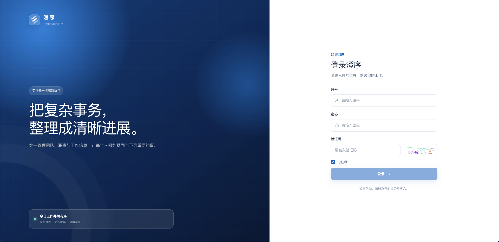
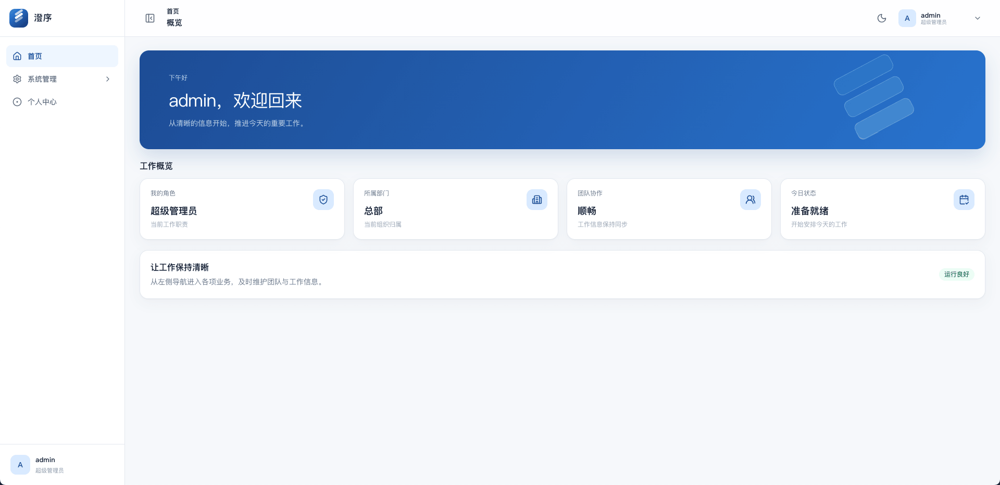
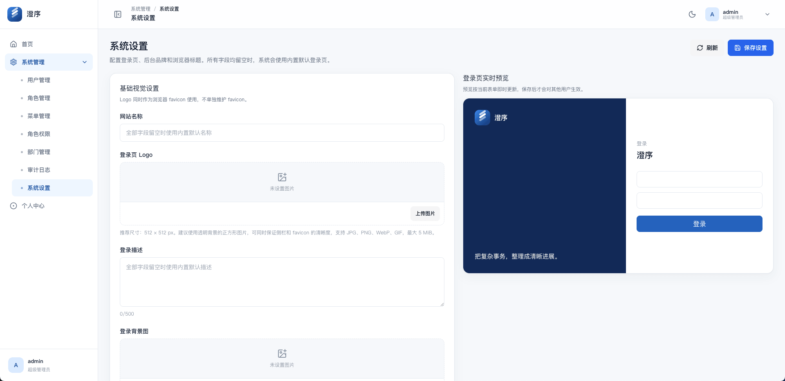

# Node Template

面向后台项目的Node全栈基础模板。它提供一套可复用的账号、角色、权限、数据范围、审计、站点视觉设置和 Docker 部署基线；业务模块应在此基础上按项目需要独立开发。

> 这不是行业业务系统。订单、客户、审批、字典、通知、对象存储等能力均按实际业务后续接入。

## 特性

- NestJS + Prisma + MySQL 服务端，Vue 3 + Vite 管理后台；
- 用户、多角色、菜单与按钮权限，权限校验在服务端失败关闭；
- 部门树与数据范围：全部、自定义部门、本部门、本部门及下级、仅本人；
- 图形验证码、登录失败锁定、短期 JWT、Redis 单会话与会话撤销；
- 关键操作审计，默认不记录密码、Token 与请求正文；
- 系统设置：网站名称、登录页 Logo/背景图/描述、备案文字与链接；Logo 自动复用为 favicon；
- 系统设置图片走独立受权限保护的上传接口，不与业务附件混用；
- 上传文件按用途与 `APP_TIME_ZONE` 日期归档，例如 `uploads/system-setting/2026-07-29/<UUID>.png`；
- 单业务 Docker 镜像包含 Vue、NestJS、内部 Nginx 与 Supervisor；MySQL、Redis 和上传卷由 Compose 管理；
- 支持同一台 Docker 主机部署多套独立实例：数据库、Redis 前缀、端口、卷和 Compose 项目名均可隔离。

## 界面预览

### 登录页



### 首页



### 系统设置

管理员可在系统设置中维护站点名称、登录页 Logo、描述、背景图与备案信息。



## 架构

```text
浏览器
  │
  ├── /admin/     Vue 3 后台 SPA
  ├── /api/       NestJS API
  ├── /uploads/   上传资源
  └── /h5/        未来移动端预留
                  │
                  ▼
        单业务镜像（Nginx + NestJS）
                  │
          ┌───────┴───────┐
          ▼               ▼
       MySQL 8          Redis 7
```

生产后台的规范入口是 `https://域名/admin/`。`/admin/index.html` 仅作兼容跳转，不应作为对外入口；未来 H5 固定使用 `/h5/`。

## 快速开始

环境要求：Node.js 20+、pnpm 10+、Docker Compose。

```bash
pnpm install
cp server/.env.example server/.env
```

编辑 `server/.env`，至少替换以下占位值：

```text
MYSQL_ROOT_PASSWORD
MYSQL_PASSWORD
JWT_SECRET
REDIS_PASSWORD
SEED_ADMIN_PASSWORD
```

然后启动本地依赖、迁移与开发服务：

```bash
pnpm infra:up
pnpm db:generate
pnpm db:migrate
pnpm db:seed
pnpm dev
```

默认访问地址：

| 服务 | 地址 |
| --- | --- |
| 后台开发服务 | `http://localhost:5173` |
| API | `http://localhost:3000` |
| Swagger | `http://localhost:3000/api-docs`（仅 `SWAGGER_ENABLED=true`） |

初始管理员使用 `SEED_ADMIN_USERNAME` 和 `SEED_ADMIN_PASSWORD` 创建。Seed 不会覆盖已存在管理员的密码。

## 常用命令

```bash
pnpm dev          # 同时启动前后端开发服务
pnpm lint         # 类型与代码规范检查
pnpm test         # 服务端测试
pnpm build        # 构建前后端
pnpm db:migrate   # 创建并执行本地 Prisma 迁移
pnpm db:seed      # 初始化基础菜单、角色和管理员
pnpm infra:down   # 停止本地 MySQL 与 Redis
```

## 生产部署

生产环境以一个 `node-template-app:<版本>` 业务镜像交付。镜像内包含后台静态资源、API、Nginx 和进程守护；生产服务器不需要编译业务代码。

```bash
docker buildx build \
  --platform linux/amd64 \
  --load \
  -f server/Dockerfile \
  -t node-template-app:1.0.0 \
  .
```

完整的镜像导出、上传、迁移、首次 Seed、升级、回滚和 HTTPS 配置，请阅读[Docker 单镜像部署手册](docs/image-deployment.md)。

## 公开仓库安全

可以提交：

- 源代码、Prisma Schema 与迁移、锁文件、Docker/Compose 文件、文档；
- `.env.example` 与 `.env.production.example`，但其中只能保留 `CHANGE_...` 等占位值。

绝不提交：

- 实际 `.env`、`.env.production`、`.env.local`；
- 密钥、证书、数据库备份、Docker 导出镜像；
- `node_modules`、构建产物、日志、上传文件与运行时卷数据。

提交前建议执行：

```bash
git status --ignored
git diff --cached --check
git grep --cached -nE 'BEGIN .*PRIVATE KEY|ghp_|github_pat_|AKIA' || true
```

如果密钥曾经提交到 Git 历史，即使后来删除文件也不安全；应立即轮换密钥，并使用专门的历史清理流程处理。

## 文档

| 文档 | 适用场景 |
| --- | --- |
| [架构说明](docs/architecture.md) | 组件、网络边界、数据与权限模型 |
| [开发指南](docs/development.md) | 本地启动、质量检查和新增模块规范 |
| [生产部署](docs/deployment.md) | 首次上线、升级、验证与回滚原则 |
| [Docker 单镜像部署](docs/image-deployment.md) | 镜像交付、服务器部署与 HTTPS |
| [同机多实例部署](docs/multi-instance-deployment.md) | 多客户/多实例隔离 |
| [备份与恢复](docs/backup-recovery.md) | MySQL、上传文件与恢复演练 |
| [安全操作](docs/security-operations.md) | 密钥轮换、代理边界与安全事件 |
| [故障排查](docs/troubleshooting.md) | 启动、登录、权限、上传与迁移问题 |

## 发布前检查

在首次推送公开仓库前，请确认：

- 所有示例配置均为占位值，真实配置只存在于本机或 Secret Store；
- `git status` 中没有 `.env`、日志、上传文件、备份或镜像 tar 包；
- 已包含 [MIT 开源许可证](LICENSE)；
- 生产部署保持 `SWAGGER_ENABLED=false`，并使用独立的数据库、Redis 密码、JWT 密钥与缓存前缀。
